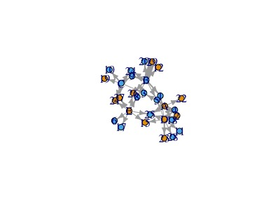
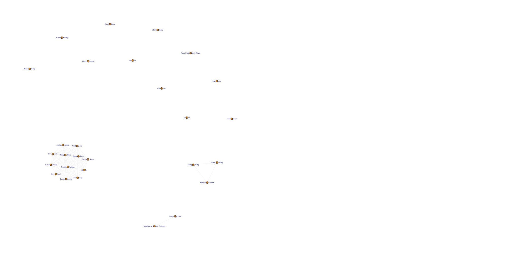
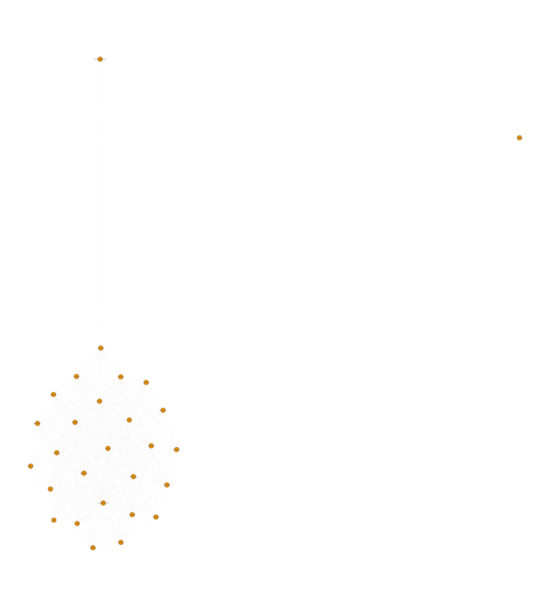

In Assignment 2 we will be looking at some disciplinary data from a middle school. The file "discipline-data.csv" shows which teacher sent which student to the principal during the semester.

We will be using the "igraph" package to visualize the disciplinary relationships between teachers and students as a network. You can read more about igraph here:

http://igraph.org/r/

Start by installing the "igraph" package. Once you have installed igraph, load the package.

Now upload the data file "discipline-data.csv" as a data frame called "D1". Each row is a disciplinary action from a teacher to a student so the first line shows that teacher "E" sent student "21" to the principal. It also shows the gender of both the teacher and student and the student's main elective field of study ("major"") and the field that the teacher instructs in ("t.expertise").

Before you proceed, you will need to change the data type of the student id variable. Since it is a number R will automatically think it is an integer and code it as such (look at the list of variables by clicking on the data frame arrow in the Data pane. Here you will see the letters "int"" next to the stid variable, that stands for integer). However, in this case we are treating the variable as a category, there is no numeric meaning in the variable. So we need to change the format to be a category, what R calls a "factor". We can do this with the following code:

```{r}
D1$stid <- as.factor(D1$stid)
```

igraph requires data to be in a particular structure. There are several structures that it can use but we will be using a combination of an "edge list" and a "vertex list". As you might imagine the edge list contains a list of all the relationships between students and teachers and any characteristics of those edges that we might be interested in. There are two essential variables in the edge list a "from" variable and a "to" variable that descibe the relationships between vertices (a disciplinary action is given "from" and teacher "to" a student). While the vertix list contains all the characteristics of those vertices, in our case gender and major.

So let's convert our data into an edge list!

First we will isolate the variables that are of interest: tid and stid

```{r}
library(dplyr)

D2 <- dplyr::select(D1, tid, stid)
```

Since our data represnts every time a teacher sends a student to the principal there are multiple rows when the same teacher sends the same student. We want to collapse these into a single row, with a variable that shows how many times a teacher-student pair appears.

```{r}

EDGE <- dplyr::count(D2, tid, stid)

names(EDGE) <- c("from", "to", "count")

```

EDGE is your edge list. Now we need to make the vertex list, a list of all the teachers and students and their characteristics in our network.

```{r}

#First we will separate the teachers from our original data frame
V.TCH <- dplyr::select(D1, tid, t.gender, t.expertise)
#Remove all the repeats so that we just have a list of each teacher and their characteristics
V.TCH <- unique(V.TCH)
#Add a variable that describes that they are teachers
V.TCH$group <- "teacher"

#Now repeat this process for the students
V.STD <- dplyr::select(D1, stid, s.gender, s.major)
V.STD <- unique(V.STD)
V.STD$group <- "student"

#Make sure that the student and teacher data frames have the same variables names
names(V.TCH) <- c("id", "gender", "topic", "group")
names(V.STD) <- c("id", "gender", "topic", "group")

#Bind the two data frames together (you will get a warning because the teacher data frame has 5 types of id (A,B,C,D,E) and the student has 25 (1-30), this isn't a problem)
VERTEX <- dplyr::bind_rows(V.TCH, V.STD)

```

Now we have both a Vertex and Edge list it is time to plot our graph!

```{r}
#Load the igraph package

library(igraph)

#First we will make an object that contains the graph information using our two dataframes EDGE and VERTEX. Notice that we have made "directed = TRUE" - our graph is directed since discipline is being given from a teacher to a student.

g <- graph.data.frame(EDGE, directed=TRUE, vertices=VERTEX)

#Now we can plot our graph using the force directed graphing technique - our old friend Fruchertman-Reingold!

plot(g,layout=layout.fruchterman.reingold)

#There are many ways to change the attributes of the graph to represent different characteristics of the newtork. For example, we can color the nodes according to gender.

plot(g,layout=layout.fruchterman.reingold, vertex.color=VERTEX$gender)

#We can change the thickness of the edge according to the number of times a particular teacher has sent a particular student to the principal.

plot(g,layout=layout.fruchterman.reingold, vertex.color=VERTEX$gender, edge.width=EDGE$count)

#Other attributes you may want to change are:

#Arrow size
edge.arrow.size=

#Remove the labels
vertex.label=NA

#Vertex size
vertex.size=
  
#And many others!
```
image: 
Play around with different graphs and then save your final version to the repo. Create a Zotero item for this R program and then commit, push and pull.

Once you have done this you need to practice with data from our class. Please create a **person-network** with the data set hudk4050-classes.csv. Once you have done this, also [look up](http://igraph.org/r/) how to generate the following network metrics: betweeness centrality and dregree. **Who is the most central person in the network?**


```{r}
library(tidyr, dplyr)
library(igraph)

K1 <- read.table("hudk4050-classes.csv", sep = ",", header = TRUE)
K2<- tidyr::unite(K1, studentName,First.name, Last.name)


K2$studentName <- as.factor(K2$studentName)
K3 <- tidyr::gather(K2,studentName,courseN)
names(K3) <- c("studentName","courseN","courseName")

K4 <- dplyr::select(K3, courseName, studentName)
K5 <- dplyr::filter(K4, courseName!="HUDK4050")
newEDGE <- dplyr::count(K5, courseName, studentName)
newEDGE = dplyr::filter(newEDGE, courseName!="")
names(newEDGE) <- c("from", "to", "count")

course <- dplyr::select(K5, courseName)
course <- unique(course)
course <- dplyr::arrange(course, courseName)
course <- dplyr::filter(course, courseName!="")
course$group <- "course"

studentNew <- dplyr::select(K3, studentName)
studentNew <- unique(studentNew)
studentNew$group <- "studentNew"

names(course) <- c("id",  "group")
names(studentNew) <- c("id", "group")


VERTEXNew <- dplyr::bind_rows(studentNew, course)
g <- graph.data.frame(newEDGE, directed=TRUE, vertices=VERTEXNew)
plot(g,layout=layout.fruchterman.reingold)

edge.arrow.size=20
vertex.label=NA
vertex.size=5
plot(g,layout=layout.fruchterman.reingold)

#following the code in revere.R
K6 <- dplyr::filter(K5, courseName!="")
K7 <- table(K6)

course.net <- K7 %*% t(K7)
student.net <- t(K7) %*% K7

diag(course.net) <- NA
diag(student.net) <- NA

course.g <- graph.adjacency(course.net,mode="undirected", weighted=NULL, diag=FALSE)
student.g <- graph.adjacency(student.net, weighted=TRUE, mode="undirected", diag=FALSE)

la <- layout.fruchterman.reingold(student.g)
e.wt <- get.edge.attribute(student.g, "weight")

pdf(file="student-view.pdf", width=10, height=10)
plot(student.g, layout=la, vertex.size=15,edge.width=e.wt,vertex.label=V(student.g)$name)
dev.off()

png(file="student-view.png", width=1000, height=1000, res=150)
plot(student.g, layout=la, vertex.size=15,edge.width=e.wt,
     vertex.label=V(student.g)$name)
dev.off()

pdf(file="course-view.pdf", width=22, height=17,pointsize=8)

la <- layout.fruchterman.reingold(course.g)
e.wt <- get.edge.attribute(course.g, "weight")

plot(course.g, layout=la, vertex.size=3,edge.width=0.1,
     vertex.label=V(course.g)$name)
dev.off()

png(file="course-view.png", width=2200, height=1700, res=150)

la <- layout.fruchterman.reingold(course.g)
e.wt <- get.edge.attribute(course.g, "weight")

plot(course.g, layout=la, vertex.size=3,edge.width=0.1,
     vertex.label=V(course.g)$name)
dev.off()

#course.net <- K7 %*% t(K7) before = case 1. person.net <- data %*% t(data) 2.person2.net <- data %*% t(data)
K7.t <- t(K7)
course2.net <- K7 %*% t(K7)
student2.net <- t(K7) %*% K7

diag(course2.net) <- NA
diag(student2.net) <- NA

course2.g <- graph.adjacency(course2.net, mode="undirected", weighted=TRUE, diag=FALSE)
student2.g <- graph.adjacency(student2.net, weighted=NULL, mode="undirected", diag=FALSE)

la <- layout.fruchterman.reingold(student2.g)
e.wt <- get.edge.attribute(student2.g, "weight")

pdf(file="student-weighted-view.pdf", width=20, height=20)
plot(student2.g, layout=la, vertex.size=15,edge.width=e.wt,
     vertex.label=V(student2.g)$name)
dev.off()

png(file="student2-weighted-view.png", width=2000, height=2000, res=150)
plot(student2.g, layout=la, vertex.size=15,edge.width=e.wt,
     vertex.label=V(student2.g)$name)
dev.off()

### Centrality

## Betweenness
btwn.student <- betweenness(student.g)
names(btwn.student) <- V(student.g)$name
ind <- order(-btwn.student)
btwn.student[ind][1:10]

## Eigenvector
cent.eig <- evcent(student.g)
names(cent.eig$vector) <- V(student.g)$name

ind <- order(-cent.eig$vector)
cent.eig$vector[ind][1:10]

#cent.eig$vector[ind][1:10]
#David_Cody       Devan_Goto          Jie_Gao    Jingtong_Feng       Chuheng_Hu 
#1.0000000        1.0000000        1.0000000        0.9194821        0.8816590 
#Samantha_Pepe      Shreya_Goel Jonathan_Stelman   Joshua_Coleman     Zhuqian_Zhou 
#0.8816590        0.6375686        0.5797423        0.5797423        0.5797423 

cent.eig <- evcent(course.g)
names(cent.eig$vector) <- V(course.g)$name
ind <- order(-cent.eig$vector)
cent.eig$vector[ind][1:10]


#cent.eig$vector[ind][1:10]
#HUDK4054  HUDK4029  ITSF4010  HUDM5059  HUDK5059  HUDM5123  HUDK4049  HUDK5030  HUDM5122  MSTU4001 
#1.0000000 0.9173929 0.6149128 0.3270369 0.2049709 0.2049709 0.1418614 0.1196965 0.1196965 0.1196965 

## Kleinberg authority
cent.klein <- authority.score(student.g)
names(cent.klein$vector) <- V(student.g)$name
ind <- order(-cent.klein$vector)
cent.klein$vector[ind][1:10]

#> cent.klein$vector[ind][1:10]
#David_Cody       Devan_Goto          Jie_Gao    Jingtong_Feng       Chuheng_Hu 
#1.0000000        1.0000000        1.0000000        0.9193911        0.8816692 
#Samantha_Pepe      Shreya_Goel Jonathan_Stelman   Joshua_Coleman    Lauren_Romine 
#0.8816692        0.6375663        0.5797494        0.5797494        0.5797494 


pdf(file="student-network-reduced.pdf", width=22, height=17,pointsize=8)
student.g.copy <- student.g
la <- layout.fruchterman.reingold(student.g.copy)
plot(student.g.copy, layout=la, vertex.size=3,vertex.label=V(student.g.copy)$name)
dev.off()

png(file="student-network-reduced.png", width=2200, height=1700, res=140)
student.g.copy <- student.g
la <- layout.fruchterman.reingold(student.g.copy)
plot(student.g.copy, layout=la, vertex.size=3,vertex.label=V(student.g.copy)$name)
dev.off()

png(file="test.png", width=2000, height=1000)
lay <- layout.fruchterman.reingold(student.g)
pr.id <- 200
# Plot the eigevector and betweenness centrality
par(mfrow=c(1,2))
plot(bonpow(student.g, exponent=1), betweenness(student.g))

e.rank <- rank(-evcent(student.g)$vector)
b.rank <- rank(-betweenness(student.g))
c.rank <- rank(-bonpow(student.g, exponent=1))
s.top <- c.rank < 10 | b.rank < 10
text(bonpow(student.g)[s.top], betweenness(student.g)[s.top], cex=0.6, pos=4, labels=V(student.g)$name[s.top])
V(student.g)[pr.id]$color <- "yellow"
E(student.g)$color="grey95"
plot(student.g, layout=lay, vertex.size=2,vertex.label.cex=0.6, vertex.label=V(student.g)$name)
dev.off()


```


image: 

#From the graphic result, the student Joonyoung_Park is in the central person in the network.

image: 

